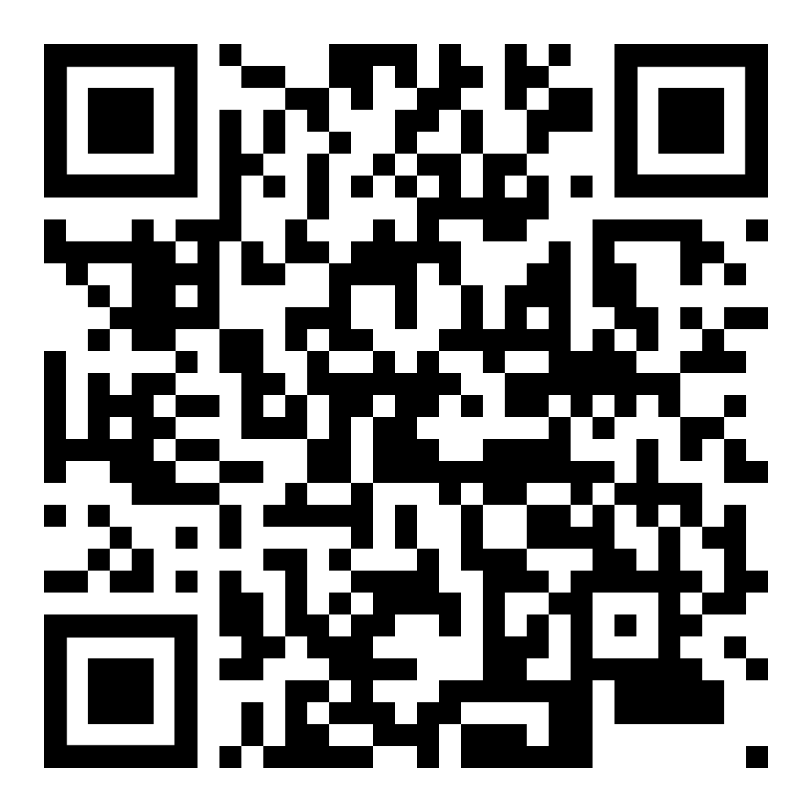

# Tractament de la Informació i Competència Digital

Proves d'accés a cicles de grau mitjà, 2026.

Ricardo Sánchez

{width="400px"}

## Currículum

### Sabers bàsics

Bloc 1: Dispositius digitals i sistemes informàtics. Sostenibilitat.
- Funcionament bàsic i característiques més importants dels dispositius digitals.
- Sistemes operatius comuns i aplicacions: instal·lació, configuració, actualització i
desinstal·lació d’aplicacions.
- Organització de la informació. Operacions bàsiques amb arxius i carpetes.
- Arquitectura bàsica dels equips informàtics: microprocessador, memòria, busos i perifèrics.
- Identificació i resolució de problemes informàtics senzills en l’entorn personal.
- Personalització de l'entorn de treball.
- Llicències de programari. El programari lliure i el programari de propietat.
- La bretxa digital.
- Història breu del desenrotllament tecnològic.
- Implicacions de la tecnologia en el desenrotllament social.
- Implicacions de l'ús dels dispositius digitals per a la salut, la sostenibilitat i el medi ambient.
Obsolescència.

Bloc 2: Xarxes i seguretat.
- Xarxes de dispositius: cablejades i sense fils.
- Fonaments i formes d'accés a Internet. Xarxes d’ordinadors.
- Protecció de dispositius i dades personals. Tècniques de tractament, organització i
emmagatzematge segur de la informació. Còpies de seguretat.
- Hàbits bàsics de seguretat per a protegir els dispositius. Mesures de protecció de dades i
d’informació. Antivirus.
- Riscos i amenaces de l'ús de dispositius i relacions en xarxa: ciberassetjament i fraus.
  
Bloc 3: Internet, informació i identitat digital.
- Tipus de buscadors web i les seues ferramentes de filtratge.
- Personalització de l'entorn de treball.
- Selecció d'informació en mitjans digitals a través de buscadors web tot contrastant-ne la
veracitat.
- Propietat intel·lectual i drets d'autoria. Tipus de drets, duració, límits als drets d’autoria i
llicències de distribució i explotació.
- La identitat personal en Internet. Àlies i avatars.
- Exposició personal en la xarxa. La petjada digital.
- Estratègies per a una ciberconvivència igualitària, segura i saludable. Etiqueta digital.
- Entorns digitals d'intercanvi social i jocs en línia. Addiccions.
- Comunitats virtuals i entorns virtuals d’aprenentatge. Col·laboració digital.
  
Bloc 4: Ofimàtica i multimèdia.
- Creació bàsica de continguts amb eines digitals.
- Ferramentes de creació i edició digital en línia.
- Elaboració i formatació de continguts en un document de text. Inserció de gràfics. Impressió
de documents.
- Ús d’estils, taules i índexs en documents de text.
- Inserció de dades, formatació de les cel·les i ús de fulls de càlcul.
- Fórmules i funcions senzilles en fulls de càlcul. Creació de gràfics .
- Elaboració, formatació, disseny de diapositives en una presentació digital.
- Altres formats de documentació tècnica: infografies, línies de temps, animacions, còmics,
llibres electrònics, mapes mentals.
- Producció i edició senzilla d’àudio i vídeo.
  
Bloc 5: Programació i Intel·ligència Artificial.
- Abstracció, seqüenciació, algorítmica i la seua representació amb llenguatge natural i
diagrames de flux.
- Introducció a la programació per blocs: composició de les estructures bàsiques i encaix de
blocs.
- Estructures de control del flux del programa. Bucles.
- Variables, constants, condicions i operadors.
- Elaboració de programes informàtics senzills.
- Elaboració de programes informàtics senzills per a dispositius mòbils.
- Fonaments de la IA. Arbres de decisió. Big data, xarxes neuronals.
- Implicacions socials i ètiques de la intel·ligència artificial.

### Criteris d'avaluació

Competència específica 1:
- Identificar característiques bàsiques dels dispositius digitals d'ús personal en l'entorn domèstic
i educatiu.
- Organitzar la informació aplicant tècniques d’emmagatzematge segur.
- Utilitzar i adaptar les eines digitals i aplicacions de l’entorn d’aprenentatge a les pròpies
necessitats.
- Descriure i valorar els drets d'autoria i llicències de drets i explotació.
- Reconéixer les implicacions de l'ús i consum de tecnologia sobre la salut i el medi ambient.
- Mostrar hàbits bàsics de seguretat per a protegir els dispositius.
  
Competència específica 2:
- Determinar quin dispositiu i forma d'accés a Internet és el més adequat a les necessitats.
- Connectar dispositius digitals a Internet de manera segura.
  
Competència específica 3:
- Fer busques bàsiques en Internet segons criteris de qualitat, actualitat i fiabilitat de les fonts.
- Identificar problemes i riscos relacionats amb l’ús de la tecnologia.
- Organitzar i gestionar l'entorn personal d'aprenentatge mitjançant la integració de recursos
digitals.
- Crear, integrar i editar continguts digitals amb sentit estètic de manera creativa i respectant els
drets d'autoria.
- Identificar i valorar diferents maneres de representar la identitat en Internet i la petjada digital
que deixen.
- Reconéixer les implicacions de la publicació de dades personals en la xarxa.
- Adoptar conductes bàsiques que protegisquen la identitat digital i les dades personals.
- Analitzar el funcionament de plataformes d'interacció social i joc en xarxa.
- Adoptar conductes bàsiques que fomenten relacions personals respectuoses i enriquidores.
- Prendre mesures bàsiques de prevenció davant l'ús continuat de dispositius digitals.
  
Competència específica 4:
- Crear i editar continguts tecnològics i digitals amb diferents formats, tant presencialment com
en remot, per a facilitar la comunicació d’idees, opinions i propostes tecnològiques.
- Respectar les llicències i drets d’autoria en la creació i comunicació d’idees.
  
Competència específica 5:
- Resoldre problemes de manera individual, utilitzant els algoritmes i les estructures de dades
necessàries.
- Programar aplicacions senzilles per a resoldre problemes elementals, usant un entorn per a
l’aprenentatge de programació basat en blocs.
- Identificar els fonaments i el funcionament de les tècniques bàsiques de IA.
- Valorar les implicacions ètiques i socials de les tècniques bàsiques de IA.

### Exàmens d'anys anteriors

https://ceice.gva.es/va/web/formacion-profesional/pruebas-de-acceso-a-ciclos-formativos

## Bloc 1: Dispositius digitals i sistemes informàtics. Sostenibilitat.

[Components d'un ordinador](./Components%20ordinador.pdf)